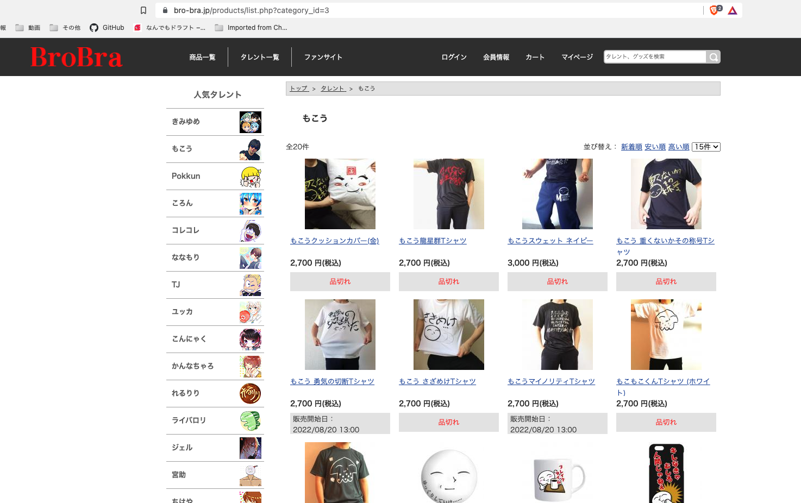
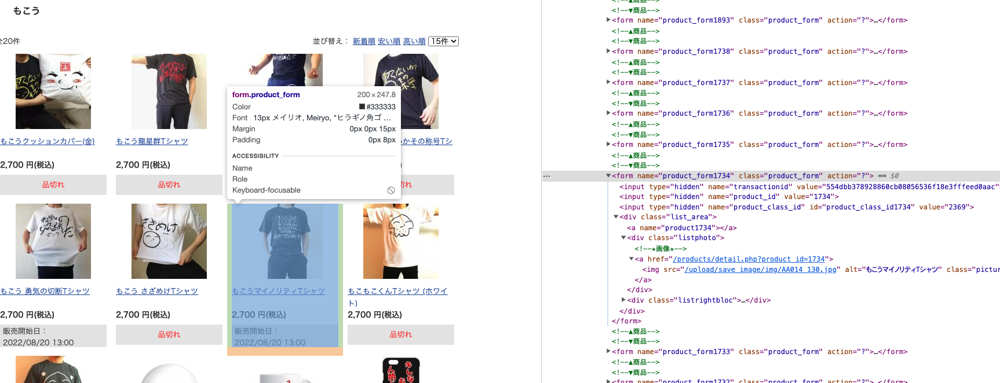

# auto-buy-mokou-T-shirt
Seleniumを利用して、[BroBra](http://www.bro-bra.jp/)で販売しているもこう先生のTシャツを最速で買うための手助けをする~~ネタ~~プログラム\
会員登録をしていない人対象です。購入手続き画面のお客様情報入力まで自動で行います。その後に続く、お支払い方法・お届け時間・入力内容確認は自分で行なってください（事故ったら怖いしね）。
ちなみに、もこう先生のTシャツだけでなく、[BroBra](http://www.bro-bra.jp/)内で販売している商品ならどれもいける...はず

以下で動作確認済み
```
Python 3.8.9
Google Chrome バージョン: 104.x.xxxx.xxx (この例だとメジャーバージョンは104)
```

## 準備, 実行
1. 必要なライブラリ等をインストールする
    ```bash
    $ pip3 install chromedriver-binary=={YOUR_CHROME_MAJOR_VERSION}.*
    $ pip3 install selenium
    $ pip3 install python-dotenv
    ```
2. `.env.example`を複製し、そのファイル名を`.env`に変更する。その後、`.env`にいろいろ書き込む
3. 以下を実行すると、Google Chrome が起動し、情報入力まで自動で行う
    ```
    $ python3 auto-buy-mokou-T-shirt/main.py
    ```

## 環境変数 MOKOU_URL, MOKOU_GOODS_IDについて
### MOKOU_URL
このレイアウト画面のURLを想定


### MOKOU_GOODS_ID
デベロッパーツールで購入したい商品の番号を確認, `product_form`の後に続く`4桁の数字`が`ID`となる\
`.env`には`cart`+`4桁の数字`で書く。


## 参考
- https://qiita.com/Chanmoro/items/9a3c86bb465c1cce738a#%E6%96%B9%E6%B3%952-%E3%83%AD%E3%83%BC%E3%82%AB%E3%83%AB%E3%81%AB%E7%92%B0%E5%A2%83%E6%A7%8B%E7%AF%89
- https://qiita.com/shobota/items/5324ca810b3848c4fd0f